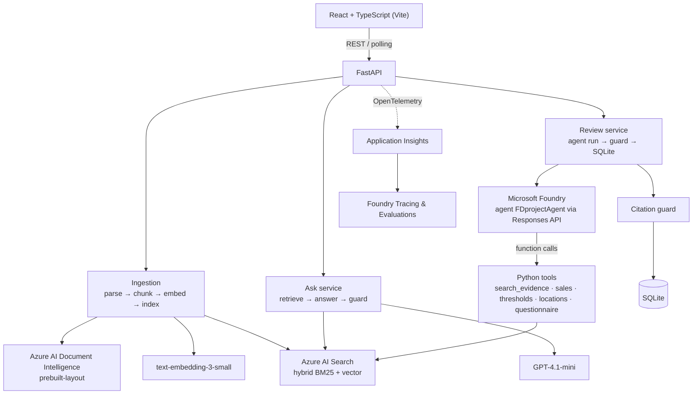

# F&D Tax Engagement Review Agent

An AI application that reviews a state-and-local-tax (SALT) engagement — nexus questionnaire,
employee/office locations, sales data and reference guidance — and produces potential nexus-risk
findings, each backed by verified document citations and deterministic calculations.

It combines a Microsoft Foundry agent, Azure OpenAI models, Azure AI Search (hybrid RAG), Azure AI
Document Intelligence, deterministic Python tools, a citation guard, evaluation, and OpenTelemetry
observability. Findings are decision support for a professional reviewer; every flag requires a
human decision. All bundled data is synthetic.

## Features

- Create engagements; upload PDF, DOCX and CSV files individually and process them in the background
- Document text extraction and page-aware chunking with Azure AI Document Intelligence
- Hybrid retrieval (BM25 + vector) over Azure AI Search, scoped per engagement
- Grounded question answering with verified citations and, for sales questions, computed figures
- Automated engagement reviews by a Foundry agent using function tools
- Deterministic Python tools for sales analysis, threshold checks, locations and questionnaire data
- Structured findings (strict JSON schema) with a citation guard that removes anything unverifiable
- Human review workflow: accept / reject / needs-more-info per flag, persisted
- Golden-set evaluation, LLM judges, and continuous evaluation of agent responses in Foundry
- OpenTelemetry tracing with token and latency accounting, exported to Application Insights

## Architecture



**Data flow.** Uploaded PDF/DOCX files are parsed by Document Intelligence, split into page-aware
chunks, embedded and indexed in AI Search under the engagement's id. The sales CSV is validated and
kept as structured data for the tools; it is never indexed. A review runs the Foundry agent, which
calls the tools through the backend, returns a structured draft, and the citation guard verifies
every citation before the result is stored and shown for human decisions.

## Tech stack

| Layer | Technology |
|---|---|
| Frontend | React 19, TypeScript, Vite, Vitest |
| Backend | Python 3.12, FastAPI, Pydantic, SQLite, uv |
| AI platform | Microsoft Foundry (agent, model deployments), Azure OpenAI GPT-4.1-mini and text-embedding-3-small |
| Retrieval | Azure AI Search (hybrid BM25 + HNSW vector index) |
| Documents | Azure AI Document Intelligence (`prebuilt-layout`) |
| Observability | OpenTelemetry, Azure Monitor exporter, Application Insights, Foundry Tracing |
| Evaluation | Golden-set scoring, Azure AI Evaluation SDK judges, Foundry Evaluations and continuous evaluation |
| Auth | `DefaultAzureCredential` everywhere — no API keys |

## Microsoft Foundry

| Capability | How it is used |
|---|---|
| Model deployments | GPT-4.1-mini for the agent, grounded answers and LLM judges; text-embedding-3-small for retrieval |
| Agents | `FDprojectAgent`, a hosted prompt agent whose instructions, tool schemas and output schema are defined in code |
| Agent versioning | `scripts/sync_agent.py` pushes the definition as a new agent version, so the running agent always matches the repository |
| Agent tools | Five function tools; the backend executes each call and returns the result to the agent |
| Responses API | Reviews run through the OpenAI Responses API with `agent_reference`; `function_call` items are answered with `function_call_output` until the agent returns its final JSON |
| Tracing | Spans for every stage, including `gen_ai` spans for model calls, appear in the project's Tracing view |
| Evaluations | Golden-set judge runs are uploaded as evaluation runs |
| Continuous evaluation | An evaluation rule scores every completed agent response with built-in evaluators |
| Application Insights | Connected to the project; the backend can discover its connection string from the project |

## The agent and its tools

The agent receives the engagement context and must return a `ReviewDraft` that conforms to a strict
JSON schema: an overall summary, risk flags (state, category, risk level, explanation, retrieved
evidence, tool findings, recommended human action) and the states reviewed without flags.

| Tool | Kind | Purpose |
|---|---|---|
| `search_evidence` | RAG | Hybrid search over the engagement's documents and reference guidance; returns passages with `chunk_id`, source and page |
| `analyze_sales_by_state` | deterministic | Revenue, transaction counts and marketplace share by ship-to state from `sales.csv` |
| `check_economic_nexus_thresholds` | deterministic | Compares each state's sales with the (illustrative) threshold table |
| `get_employee_locations` | deterministic | Offices, remote employees and other sites by state |
| `get_questionnaire_answers` | deterministic | The client's self-reported answers, optionally by section |

Guarantees enforced by the backend:

- The engagement id comes from the request context; tool argument models forbid extra fields, so
  the model cannot target another engagement or file.
- Arithmetic and threshold comparisons happen only in Python tools, attributed as `tool:<name>`.
- The **citation guard** keeps a citation only if its `chunk_id` was retrieved in the same run,
  overwrites source and page from the index, clears non-verbatim quotes and drops findings from
  tools that did not run. It never adds anything and reports what it changed.
- The output schema is enforced by Foundry (strict mode) and re-validated with Pydantic.

The grounded **Ask** flow reuses the same retrieval, the `analyze_sales_by_state` tool and the same
citation guard, returning an answer, verified citations, the retrieved passages, and structured
evidence attributed to `sales.csv`.

## Retrieval: Azure AI Search

Index `fd-evidence` stores one document per chunk: `chunk_id` (key), `engagement_id`, `doc_id`,
`doc_type`, `source_name`, `page`, `content` (BM25) and `content_vector` (1536-d HNSW). Queries
combine keyword and vector search and are always filtered to the current engagement plus shared
reference guidance. Re-processing a document deletes its stale chunks before upserting.

## Azure AI Document Intelligence

`prebuilt-layout` extracts paragraphs and tables with page numbers. The parser keeps reading order,
removes the duplicate paragraphs that layout output emits for table cells, renders tables as
Markdown, and strips selection-mark tokens. Chunks never cross a page boundary, so every citation
carries a real page number.

## Evaluation and observability

**Evaluation** (`backend/evals/`): a golden set of four controlled variants of the synthetic
engagement, each with the flags a correct review must and must not raise. Each case is built as a
throwaway engagement through the normal upload → process → review path, scored deterministically
(expected-flag recall, forbidden-flag violations, citation validity, tokens, latency) and optionally
judged for groundedness and relevance against the passages it actually cites. Results can be
replayed offline and uploaded to Foundry Evaluations; a continuous-evaluation rule scores live agent
responses with Foundry's built-in evaluators.

**Observability** (`backend/app/observability/`): OpenTelemetry spans for ingestion
(`ingest.document`, `di.analyze_layout`, `chunk`, `embed`, `search.upsert`), retrieval
(`search.hybrid`), reviews (`review.run`, `agent.turn`, `tool.<name>`, `citation_guard`) and
questions (`ask.answer`, `chat.complete`), with `gen_ai` attributes on model calls. Attributes carry
ids and counts only. Token usage and per-stage latency are stored with every review and answer and
shown in the UI. Logs carry trace and span ids.

## Configuration

All settings are environment variables (see `.env.example`); copy it to `backend/.env` and fill in
the endpoints. There are no keys: authentication is `DefaultAzureCredential` (Azure CLI login
locally, Managed Identity when deployed).

| Setting | Purpose |
|---|---|
| `FOUNDRY_PROJECT_ENDPOINT`, `FOUNDRY_AGENT_NAME` | Foundry project and hosted agent |
| `FOUNDRY_CHAT_DEPLOYMENT`, `FOUNDRY_EMBEDDING_DEPLOYMENT` | Model deployment names |
| `AZURE_SEARCH_ENDPOINT`, `AZURE_SEARCH_INDEX_NAME` | AI Search service and index |
| `AZURE_DOCUMENT_INTELLIGENCE_ENDPOINT` | Document Intelligence resource |
| `OPENAI_TIMEOUT_SECONDS`, `OPENAI_MAX_RETRIES`, `AZURE_TIMEOUT_SECONDS` | Client budgets |
| `APPLICATIONINSIGHTS_CONNECTION_STRING`, `OTEL_USE_FOUNDRY_APP_INSIGHTS`, `OTEL_CONSOLE_EXPORT` | Tracing export (leave unset to trace locally without exporting) |

Required Azure resources: a Foundry project with the two model deployments and the agent, an Azure
AI Search service (Basic tier is sufficient) with role-based access enabled, and a Document
Intelligence resource. Your identity needs *Azure AI User* on the Foundry project, *Search Index
Data Contributor* and *Search Service Contributor* on AI Search, and *Cognitive Services User* on
Document Intelligence. For continuous evaluation, the project's managed identity needs the
*Foundry User* role on the project.

## Run

Prerequisites: Python 3.12 with [uv](https://docs.astral.sh/uv/), Node.js 20+ with npm, and the
Azure CLI.

```bash
az login
cp .env.example backend/.env         # then fill in the endpoints
```

Backend:

```bash
cd backend
uv sync
uv run python -m scripts.check_azure          # verifies the three Azure services are reachable
uv run python -m scripts.create_search_index  # creates the index (idempotent)
uv run python -m scripts.sync_agent           # pushes the agent definition to Foundry
uv run uvicorn app.main:app --port 8000 --reload
```

Frontend:

```bash
cd frontend
npm install
npm run dev                                   # http://localhost:5173 (proxies /api to :8000)
```

In the app: create an engagement, upload the questionnaire PDF, locations DOCX, sales CSV and the
tax reference guide PDF (sample files are in `data/synthetic/`), process them, ask questions, run a
review, and record decisions on the findings.

Optional:

```bash
uv run python -m scripts.run_evals --judge            # golden-set evaluation (add --upload for Foundry)
uv run python -m scripts.setup_continuous_eval        # continuous evaluation of agent responses
uv run python -m scripts.run_review --engagement <id> # review from the command line
```

## Tests and checks

```bash
cd backend && uv run pytest && uv run ruff check . && uv run mypy
cd frontend && npm test && npm run lint && npm run build
```

Unit and integration tests run without Azure: every SDK client is behind a small wrapper with a fake
in tests, and telemetry export is disabled in the test process.

## Repository layout

```
backend/
  app/
    api/             FastAPI routers and dependencies
    agent/           Foundry agent runner, tool registry, citation guard, instructions
    azure/           Keyless wrappers: Document Intelligence, embeddings, chat, AI Search
    services/        Engagements, ingestion, processing, ask, review
    tools/           Deterministic tools and the illustrative threshold table
    db/              SQLite repositories
    observability/   OpenTelemetry tracing and log correlation
  evals/             Golden set, scoring, judges, runner
  scripts/           Setup, ingestion, review and evaluation commands
frontend/            React application
data/synthetic/      Synthetic sample engagement (committed); uploads and the database are ignored
```

## Limitations

- Structured questionnaire and locations data are not extracted from the uploaded PDF/DOCX; the
  deterministic tools read structured files that currently exist only for the synthetic sample.
- No end-user authentication; single-tenant, SQLite and local file storage.
- Reviews are asynchronous with polling; questions are synchronous; no streaming.
- Thresholds and reference guidance are illustrative, not statements of law.
